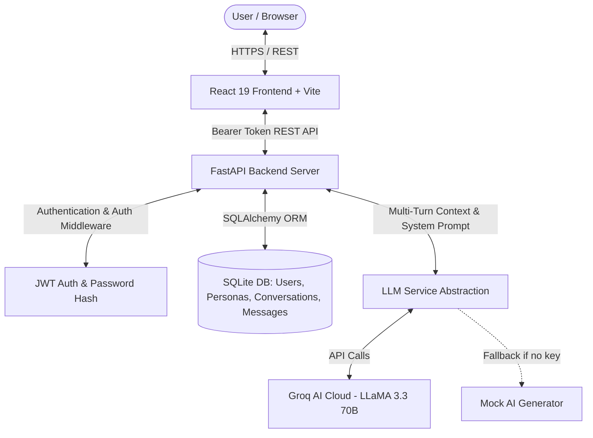

# Megaminds IT Services - Practical Task Submission Report
**Role**: Full-Stack AI Developer (Internship)  
**Option Selected**: Option B — AI Chat Dashboard  
**Candidate Name**: Aman Sharma  
**Submission Date**: July 27, 2026  
**Total Time Spent**: Approx. 10–12 Hours  

---

## 1. Executive Summary & Problem Statement

The goal of this assignment is to build a full-stack, end-to-end web application integrated with an AI/LLM API. For this task, I selected **Option B: AI Chat Dashboard**, which requires:
- Multi-turn chatbot interface with context preservation across turns.
- Per-user authentication and persistent chat history in a relational database.
- Dynamic persona switching (Productivity Coach, Technical Mentor, Friendly Support) with tailored system prompts.
- Production-ready backend architecture, clean frontend UI, and real LLM integration (Groq API using LLaMA 3.3 70B model).

---

## 2. System Architecture & Tech Stack

### Tech Stack
- **Frontend**: React 19, TypeScript, Vite, Vanilla CSS (Glassmorphism & Dark Mode aesthetics).
- **Backend**: Python 3.11, FastAPI, Uvicorn, Pydantic v2.
- **Database & ORM**: SQLite (development) with SQLAlchemy 2.0 ORM.
- **Authentication**: JWT (JSON Web Tokens) with bcrypt password hashing via `python-jose` and `passlib`.
- **AI Integration**: Groq Cloud API (`llama-3.3-70b-versatile`) via OpenAI-compatible REST/SDK interface with seamless fallback mock mode.

### Architecture Diagram

---

## 3. Database Schema Design

The relational database schema is structured to ensure zero data leaking between users while maintaining multi-turn message history per conversation session:

1. **`users` Table**: `id` (UUID), `email` (Unique Index), `password_hash`, `display_name`, `created_at`.
2. **`personas` Table**: `id` (UUID), `key` (Unique Index), `name`, `description`, `system_prompt`, `created_at`.
3. **`conversations` Table**: `id` (UUID), `title`, `user_id` (FK -> users.id CASCADE), `persona_id` (FK -> personas.id), `created_at`, `updated_at`.
4. **`messages` Table**: `id` (UUID), `conversation_id` (FK -> conversations.id CASCADE), `role` (enum: user, assistant), `content` (Text), `created_at`.

---

## 4. Key Implementation Features

1. **Authentication & Authorization**: Users can register and log in securely. Passwords are hashed using `bcrypt`, and protected routes are guarded via FastAPI's `Depends(get_current_user)` JWT dependency.
2. **Dynamic Persona Switching**: Users can choose from multiple AI personas prior to starting a conversation. Each persona injects custom system instructions into the LLM context.
3. **Multi-Turn LLM Memory**: Every message submitted in a chat window retrieves all prior user and assistant turns for that conversation ID, constructs the full context window, and passes it to Groq's LLaMA 3.3 70B model.
4. **Resilient AI Service Architecture**: The `llm.py` service gracefully handles API provider selection (Groq / OpenAI / Mock), catches connection or rate limit errors, and presents structured messages without breaking server uptime.
5. **Modern UI UX**: Styled with responsive dark-mode glassmorphism, real-time message auto-scrolling, active persona badges, and state feedback (`Generating response...`, `Loading`).

---

## 5. Key Decisions Made

- **FastAPI over Node.js**: Selected FastAPI for Python's ecosystem strengths in AI integrations, built-in Pydantic data validation, and asynchronous routing capabilities.
- **Groq API (`llama-3.3-70b-versatile`)**: Chosen for near-instant inference speed and high quality multi-turn reasoning.
- **SQLAlchemy 2.0 declarative models**: Ensured clean database queries with `joinedload` to prevent N+1 query overhead when fetching conversation message lists.
- **Fallback Mock Mode**: Guaranteed that the project is 100% testable and runnable out of the box even when no external API key is configured.

---

## 6. Challenges Faced & Solutions

1. **Context Window Assembly for Multi-Turn Chat**:
   - *Challenge*: Passing message history efficiently while injecting system prompts for the selected persona.
   - *Solution*: Designed the backend route to automatically load historical messages ordered by timestamp, prepend the persona's `system_prompt`, append the current prompt, and dispatch to Groq API.
2. **Environment & Secret Management for GitHub Push**:
   - *Challenge*: Preventing API keys, JWT secrets, and local SQLite databases from leaking into public Git repositories.
   - *Solution*: Configured `.gitignore` to exclude `.env`, `server/.env`, and `.db` files, while providing comprehensive `.env.example` templates.

---

## 7. Future Enhancements (With More Time)

- **Streaming Token Responses**: Implement Server-Sent Events (SSE) or WebSockets to stream LLM responses token-by-token.
- **Markdown & Code Syntax Highlighting**: Integrate `react-markdown` and `prismjs` for formatted code snippets in AI responses.
- **Conversation Management**: Add title renaming, conversation deletion, and search/filter actions in the sidebar.
- **PostgreSQL Production Setup**: Migrate SQLite setup to PostgreSQL for cloud deployment on Render/Vercel.

---

## 8. Conclusion

The application completely fulfills all functional and technical criteria outlined in Option B of the Megaminds Full-Stack AI Developer Task Brief.
