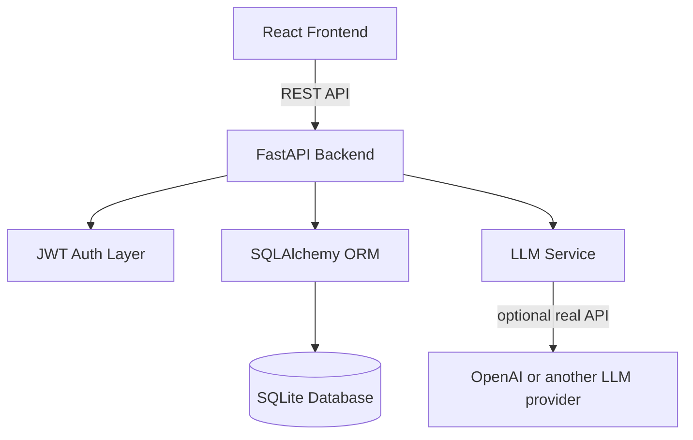

# Project Report - Megaminds AI Chat Dashboard

## 1. Problem Statement
Build a small full-stack AI chat application with authentication, multi-turn conversation support, persona switching, and persistent user chat history.

## 2. Chosen Approach
I selected Option B because it best balances implementation speed and full-stack depth within the assignment deadline. It allows a complete demonstration of frontend, backend, authentication, persistence, and AI integration in one cohesive product.

## 3. Tech Stack
- Frontend: React, TypeScript, Vite
- Backend: Python, FastAPI
- Database: SQLAlchemy with SQLite for local development
- Authentication: JWT
- AI Layer: OpenAI-ready integration with a mock fallback mode

## 4. Architecture Diagram

## 5. Key Features
- Register and log in users
- Create persona-specific chat sessions
- Persist conversation history per user
- Send and retrieve multi-turn messages
- Swap in a real LLM API key later without changing the UI flow

## 6. Key Decisions Made
- Chose Option B for strongest coverage of required full-stack skills
- Used SQLAlchemy + SQLite to keep setup fast and reproducible
- Kept AI integration behind a service abstraction so a real provider can be enabled later
- Used a default mock mode to ensure the app remains fully demoable even without external API access

## 7. Challenges Faced
- Designing the app so it still demonstrates AI integration without requiring a live API key
- Keeping the feature set complete while staying within the deadline
- Making persona switching feel meaningful while keeping the schema simple

## 8. Improvements With More Time
- Add streaming token responses
- Add conversation rename/delete actions
- Add password reset flow
- Add markdown rendering and code formatting in assistant messages
- Add PostgreSQL production deployment configuration
- Add automated tests for API routes and UI flows

## 9. Approximate Time Spent
Fill this in with your actual time before submission.
